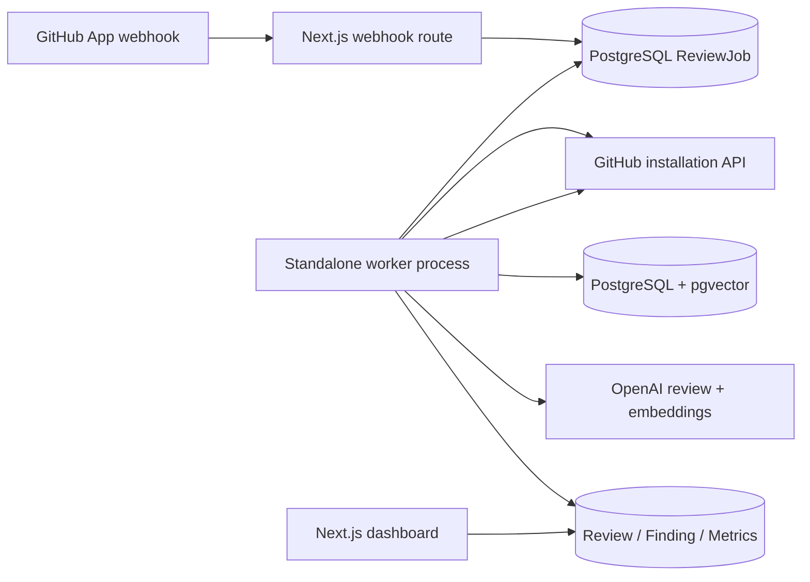

# AI Pull Request Reviewer

An engineering-focused portfolio project for reviewing GitHub pull requests with a GitHub App, OpenAI, deterministic risk scoring, and repository-aware standards retrieval.

> Screenshot placeholder: add a dashboard overview image here.
> Screenshot placeholder: add a pull-request review with inline findings here.

## What it does

- Verifies GitHub App webhooks and durably queues `pull_request.opened` and `synchronize` events.
- Fetches PR diffs and changed files with installation-scoped Octokit clients.
- Produces structured AI findings for bugs, security, performance, maintainability, and cited repository-standard violations.
- Calculates an explainable, deterministic 1–10 risk score from change volume, security findings, authentication, migrations, APIs, and high-severity issues.
- Indexes `README.md`, `CONTRIBUTING.md`, `docs/*`, and `architecture/*` into PostgreSQL + pgvector for repository-scoped RAG context.
- Includes a responsive Next.js dashboard shell for repository metrics, review history, risk, and issue categories.

## Architecture



The webhook only verifies and persists work; it does not run AI in the request. Run the worker as a separate long-lived process in deployment. The dashboard intentionally fails closed until a server-side identity provider is wired to `User` and `RepositoryMembership`.

## Stack

Next.js App Router, TypeScript, Tailwind CSS, Recharts, PostgreSQL, Prisma 7, pgvector, OpenAI, Octokit, GitHub App, Zod, Node test, and Vitest.

## Local setup

1. Install Node.js 20+ and PostgreSQL with the `vector` extension available.
2. Install dependencies:

   ```bash
   npm install
   ```

3. Configure server-only environment variables:

   ```text
   DATABASE_URL=
   GITHUB_APP_ID=
   GITHUB_APP_PRIVATE_KEY=
   GITHUB_WEBHOOK_SECRET=
   OPENAI_API_KEY=
   OPENAI_REVIEW_MODEL=
   OPENAI_EMBEDDING_MODEL=
   RAG_RETRIEVAL_LIMIT=
   ```

4. Generate and apply Prisma artifacts/migrations:

   ```bash
   npm run prisma:generate
   npm run prisma:validate
   ```

   The database must allow `CREATE EXTENSION vector`; the initial migration creates the `vector(1536)` RAG column and HNSW index.

5. Start the dashboard:

   ```bash
   npm run dev
   ```

6. Configure a GitHub App with pull-request read/write access, repository metadata read access, and a webhook URL at:

   ```text
   https://your-host/api/github/webhook
   ```

7. Run the durable review worker separately using the project worker command/configuration. In production, run it as a dedicated process with database access and the same GitHub/OpenAI environment variables.

## Design decisions

- **Durable jobs over request-time AI:** webhook requests acknowledge only after idempotent persistence.
- **RAG is scoped:** retrieval filters by repository, branch, and embedding model to prevent cross-repository context leakage.
- **Structured output first:** Zod validates AI JSON before findings are persisted or published.
- **Explainable risk:** risk is deterministic and returns factors/reasons, not an opaque AI score.
- **Safe dashboard default:** without authenticated repository membership, no global data is queried or shown.

## Challenges and tradeoffs

- Prisma does not natively materialize pgvector values, so metadata is modeled in Prisma while vector reads/writes use parameterized raw queries.
- GitHub and OpenAI are retried only for bounded transient failures; durable jobs retain terminal errors for investigation.
- The project favors a small PostgreSQL-backed queue over introducing Redis or a managed workflow platform.
- The dashboard identity provider is deliberately a typed integration seam rather than a fake authentication implementation.

## Quality checks

```bash
npm run typecheck
npm test
npm run build
```

## Future enhancements

- Wire GitHub OAuth or an enterprise SSO provider to the dashboard membership scope.
- Add lease recovery, publication outbox reconciliation, and stale-head revalidation for worker crash/race resilience.
- Add organization policy management, richer review filtering, and trend analytics.
- Add multi-language code context, configurable review rules, and cost/latency observability.
