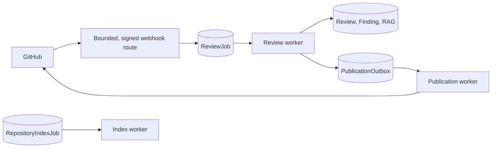

# AI Pull Request Reviewer

A GitHub App-backed pull-request reviewer with durable PostgreSQL work queues, validated AI findings, pgvector standards retrieval, and a fail-closed dashboard.

## Reliability model



- Webhooks are verified against the raw, byte-limited body before parsing. Valid deliveries are rate-limited in PostgreSQL and queued idempotently by GitHub delivery ID.
- Review, finding, metrics, and publication-outbox records are persisted before any GitHub write. Findings remain `PENDING`, `SUPPRESSED`, `PUBLISHED`, or terminally `FAILED` independently.
- Workers claim rows with `FOR UPDATE SKIP LOCKED`, expiring leases, heartbeats, ownership checks, bounded exponential backoff, and terminal failure state.
- Publication payloads carry a stable idempotency key and hidden GitHub review marker. On recovery, the publisher searches for the marker before creating a review.

### Important delivery limitation

GitHub's review-create API has no caller-supplied idempotency key. The outbox and marker lookup prevent ordinary duplicate posts, including the common crash-after-GitHub-success case, but a crash/race between lookup and GitHub's write can still produce a duplicate. Publication is therefore **at-least-once**, not exactly-once. Operators should reconcile a terminal/ambiguous outbox record against GitHub before manual intervention.

## Local setup

Requirements: Node.js 20+, PostgreSQL with `pgvector`, and a GitHub App.

```bash
npm ci
export DATABASE_URL=postgresql://...
npm run prisma:generate
npm run prisma:validate
npx prisma migrate deploy
npm run dev
```

Server-only configuration:

```text
DATABASE_URL=
GITHUB_APP_ID=
GITHUB_APP_PRIVATE_KEY=
GITHUB_WEBHOOK_SECRET=
OPENAI_API_KEY=
OPENAI_REVIEW_MODEL=
OPENAI_EMBEDDING_MODEL=
RAG_RETRIEVAL_LIMIT=

# Webhook protection (optional defaults shown)
GITHUB_WEBHOOK_MAX_BYTES=1048576
GITHUB_WEBHOOK_RATE_LIMIT=120
GITHUB_WEBHOOK_RATE_WINDOW_MS=60000

# Worker (optional defaults shown)
REVIEW_WORKER_ID=
REVIEW_WORKER_POLL_MS=1000
REVIEW_WORKER_HEALTH_PORT=8081

# GitHub App user authorization (dashboard)
GITHUB_APP_CLIENT_ID=
GITHUB_APP_CLIENT_SECRET=
GITHUB_APP_CALLBACK_URL=https://your-host/api/auth/github/callback
APP_SESSION_SECRET=at-least-32-random-bytes
```

Configure the GitHub App webhook at:

```text
https://your-host/api/github/webhook
```

Grant least-privilege repository metadata and pull-request read/write permissions. The reviewer never exposes App credentials, OAuth codes, access tokens, or database URLs to the browser.

## Workers and operations

Run the long-lived worker separately:

```bash
npm run worker
```

It processes review jobs, publication outbox rows, and repository indexing jobs fairly in one polling loop. It exposes:

```text
GET /healthz  # process liveness
GET /readyz   # PostgreSQL readiness probe
```

Both structured worker logs and persisted failure messages redact common token, secret, password, authorization, and connection-string forms. Raw webhook bodies, diffs, OAuth codes, and access tokens are never logged.

### GitHub identity and membership

`GET /api/auth/github` starts a state-protected GitHub App-compatible OAuth flow; its callback creates/updates only the authenticated GitHub `User`. During callback, the server asks GitHub for installations accessible to that user and grants memberships only for installations/repositories GitHub reports and that already exist locally. Personal-account installations map to `ADMIN`; organization installations map to `VIEWER` unless an application-side administrator grants a stronger role.

The dashboard is deliberately empty when unauthenticated. It never falls back to global/demo data. Authenticated API routes enforce membership:

```text
GET   /api/repos
PATCH /api/repos/:repositoryId                 {"enabled": boolean}  # ADMIN/OWNER
POST  /api/repos/:repositoryId/index           {"force": boolean}    # ADMIN/OWNER
POST  /api/reviews/:reviewId/retry                              # ADMIN/OWNER, failed only
```

## RAG indexing and provenance

Repository standards indexing is a durable `RepositoryIndexJob`, not request-time work. Index jobs retain status, attempts, errors, timestamps, document/chunk counts, embedding model, and lease state on the repository and job records.

Queue a reindex through the authorized API or manually:

```bash
npm run index:repository -- --repository-id <repository-database-id> --force true
```

The indexer allows only selected Markdown guidance paths, persists source path/content SHA/chunk provenance with each vector, and removes stale documents only after a complete successful snapshot. Retrieval is always constrained by repository, branch, and embedding model. The prompt receives stable `[standard:path#chunk@sha]` labels; only citations that match retrieved labels are retained and persisted in finding evidence.

## Demo fixture

The dashboard does not seed data automatically. To create clearly labeled local demo records only:

```bash
npm run seed:demo
```

The fixture creates no GitHub review or external side effect.

## Quality checks

```bash
npm run prisma:generate
npm run prisma:validate
npm run typecheck
npm test
npm run build
```

`.github/workflows/ci.yml` runs the same checks against a local `pgvector/pgvector:pg16` service, applies the Prisma schema, and executes the optional pgvector integration test without external database credentials.

## Scope and limitations

- GitHub publication is at-least-once as described above; marker reconciliation lowers, but cannot eliminate, external duplicate risk.
- OAuth membership synchronization depends on GitHub returning the user's accessible App installations. Existing installations/repositories are not fabricated when GitHub is unavailable.
- The service indexes bounded standards documents, not arbitrary codebases or repository history.
- Production deployments should run migrations, dashboard, and worker separately with managed PostgreSQL backups and secret-manager-provided environment variables.
